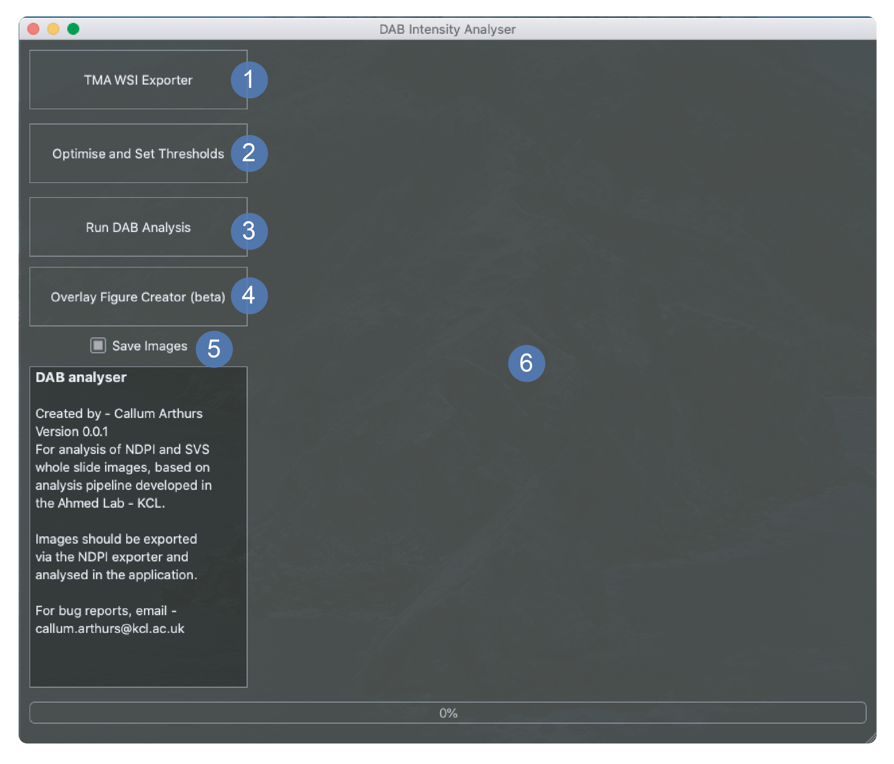

# TMAPP
The App for the TMA histology cutter and analyser

The latest release is out! click on releases on the right hand side of the page and download the zip file. 
At the moment only the mac version is uploaded as I am waiting to deploy it on Windows and Linux. 

Log any issues in the issues tab and I will try to address them as soon as possible. 
Email me for a video of how the exporter works.

 

  
Tissue core export
 
  
DAB intensity threshold selection
 
  
DAB analysis running across all images in a directory
