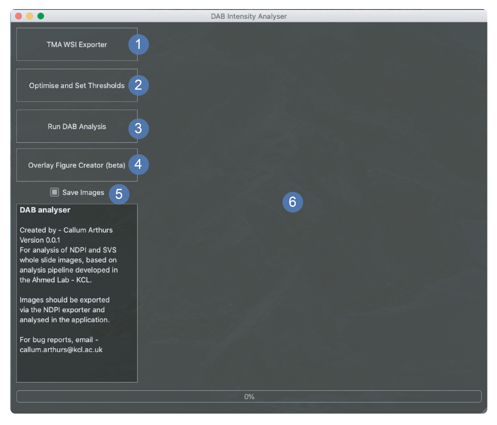
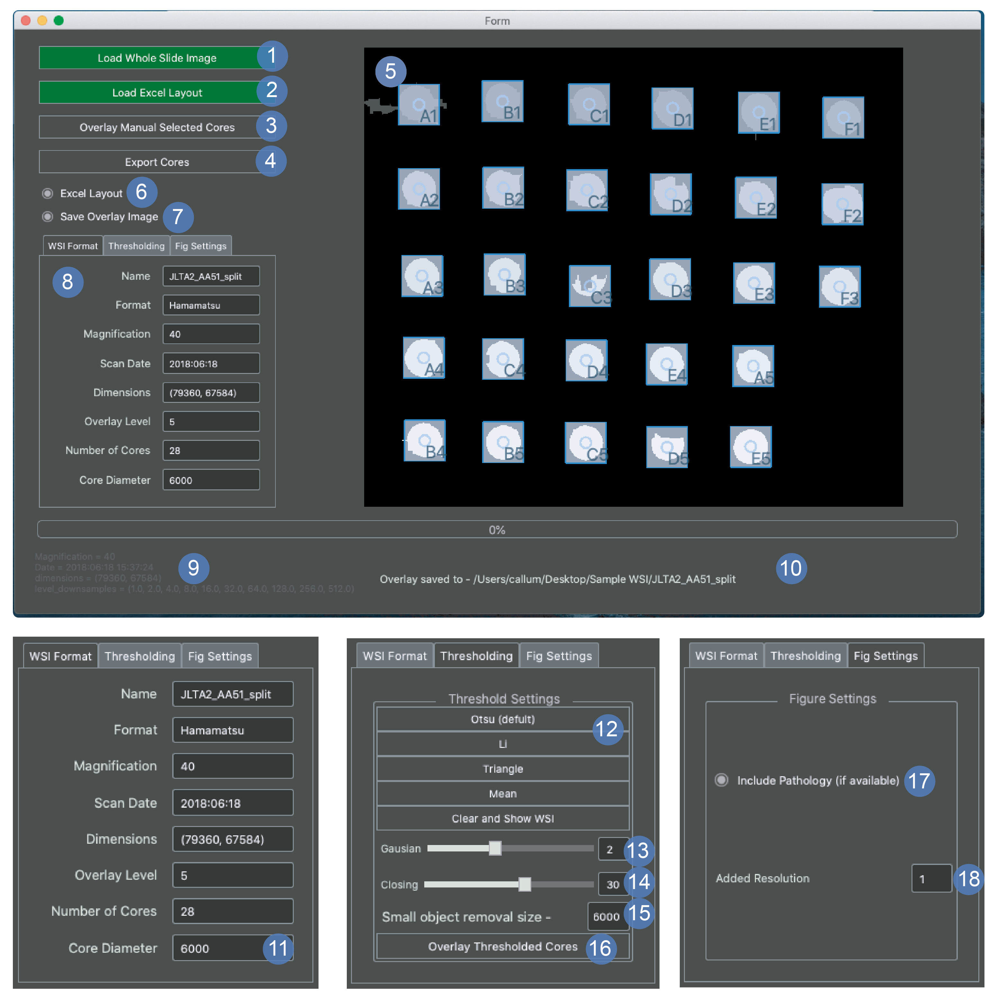
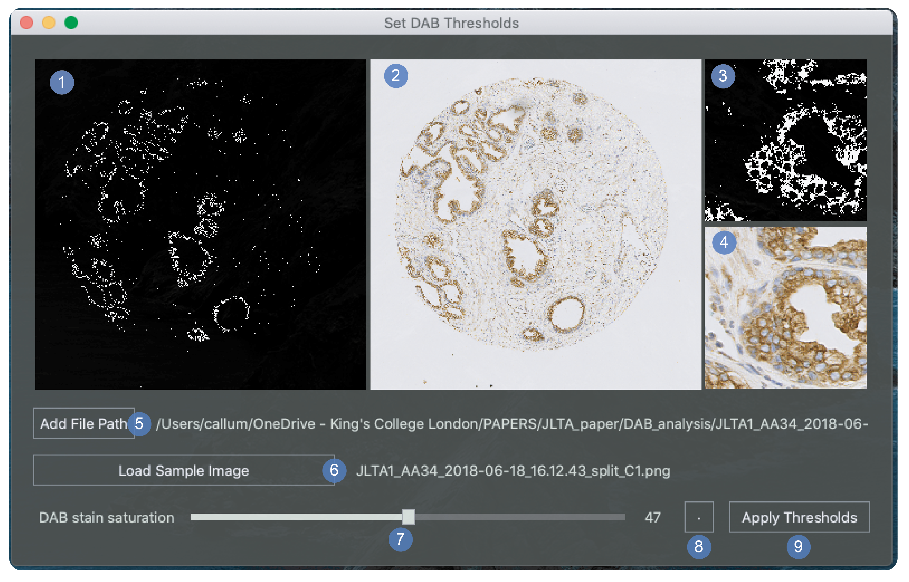

# TMAPP
The App for the TMA histology cutter and analyser

The latest release is out! click on releases on the right hand side of the page and download the zip file. 
At the moment only the mac version is uploaded as I am waiting to deploy it on Windows and Linux. 

Log any issues in the issues tab and I will try to address them as soon as possible. 
Email me for a video of how the exporter works.
  
## TMApp main screen window
  
 
This screen is used to select between the following options - 
1. Opens the [Whole slide image (WSI) exporter](#tma-image-export-window)
2. Opens the [Set threshold screen](#dab-stain-threshold-selection-window)
3. Run DAB analysis in the current window
4. Overlay figure creator - this is currently not available

    **5 and 6 are both used as a part of the DAB analysis process when button 3 is selected**
5. "Save images" is used to select whether you would like to save the mask images during the DAB analysis. 
This will slow the process slightly. 
6. Viewer panel - this displays a low resolution version of the tissue core that is currently being analysed. 
It will then show the low resolution mask of the same image that had been applied. This is useful for spotting a 
poor threshold selection whilst analysis is running
 

## TMA image export window
  
 
**This window is for exporting png images from whole slide images using a map of the array that is provided by the user - 
see [array map example](#array-map-example)**
1. Load WSI - prompts a dialog box for the user to select a ndpi or svs file
2. Load Excel - this is a prompt to load the excel map - if the excel is named the same as the array and in the same 
directory then it will be loaded automatically on the WSI load. if this has happened then the button will turn green. 
This can also be used to reload the excel map at any point if the map has been changed my the user. 
3. Overlay manually selected cores. This is applied after a user selection has been applied in panel number 5. It can 
also be used after the cores have been moved to update the window. 
4. Export cores - Only click when happy that the cores are in the right place. Will disable user input and export the 
core png images to the WSI directory. 
5. Display window - double click to add core - spacebar to remove last point. Can drag pre applied cores. 
6. Excel layout - the recommended way to index cores is with the row names as the number and the column names as the 
letter (A6 - col A row 6). If you want to reverse this (A6 - row A col 6) then uncheck the box when the window opens
7. Save overlay image - whether or not to automatically save the image in the viewer (5)
8. Tab viewer window - further explained in points 11-18
9. Image metadata for thw WSI file
10. Progress update panel. Any updates will apear here
11. Core diameter. This is currently set to 6000 pixels - similar bounding box size as a 1mm diameter tissue core. 
This value can be chosen before image export and you can see what the new selection looks like by selecting the overlay 
cores button (3). 
12. Thresholding options. Choose the best threshold then proceed to 13
13. Gausian blur. This is the sigma value applied to the gausian. must be applied after 12
14. Closing. After 13 apply some binary morphological closing. higher slider values will lead to a more closed mask. 
15. Removal of small objects from the mask. This is the value of the minimum size to be removed. if you have very small 
cores then this will need to be reduced. 
16. This applies the changes added in steps 12-15 and overlays the core images and labels.
17. These are the settings for the first figure that is exported. This option will add a bounding box to the figure
to denote the pathology of the core - red or green. This will only work if the first tab of the xlsx file with the array 
contains a map indexed with N and T for normal and tumour, respectively. Please see the 
[array map example](#array-map-example) for more details in indexing pathology. 
18. if you increase this number then it will increase the level that the images are taken from in the WSI. Increasing
 it will exponentially slow the program down so use sparingly. 

## DAB stain threshold selection window
 
 
**This window is to help select a minimum saturation of the brown chromogen stain to measure**

1. Mask for the whole image - white pixels will be measured as stain. Low resolution. 
2. Origional whole image at a low resolution
3. Full resolution magnification mask
4. Full resolution magnification image
5. Add a file path. This is used to select the directory containing the PNG images that will be used to optimise the
threshold. A random image from this file will be loaded into the window. 
6. Load sample image. This will load a new random image into the window. It is good to optimise the thresholds on
at least 10 images
7. Saturation slider. This will change the minimum saturation value for the DAB stain. The value will be displayed in 
windows 1 and 3. 
8. toggle button. shows the origonal image again - now depreciated. 
9. Apply thresholds. This sends the new threshold to the main window of the program. This should be selected before 
pressing the DAB analysis button in the main window. The thresholds button will turn green. 

## Array Map Example
