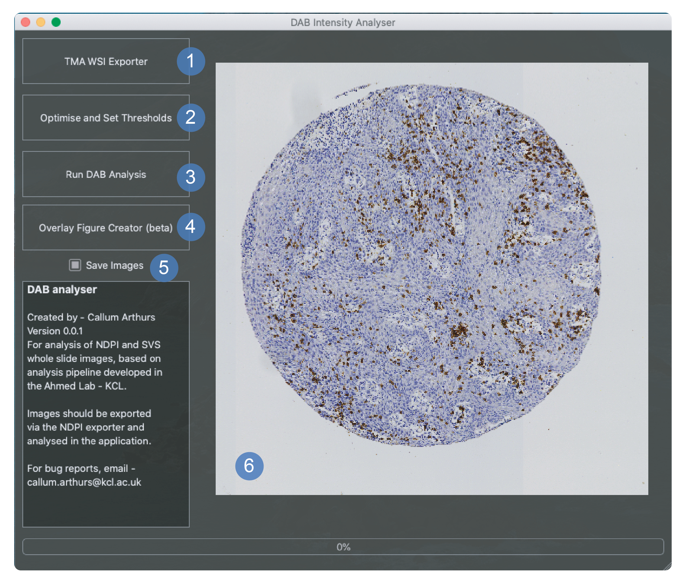
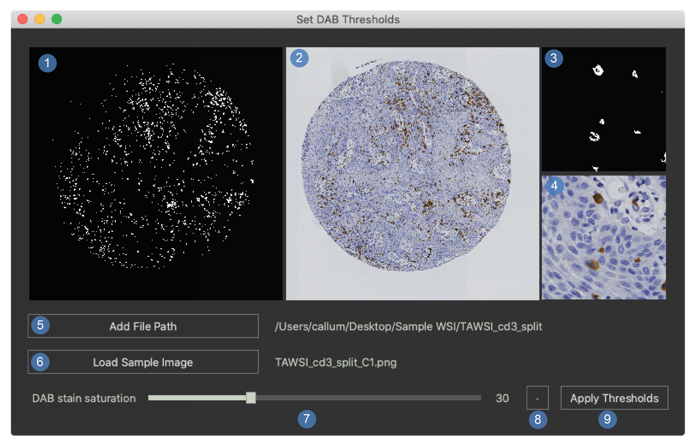

# TMAPP
The App for the TMA histology cutter and analyser

The latest release is out! click on releases on the right hand side of the page and download the zip file. 
At the moment only the mac version is uploaded as I am waiting to deploy it on Windows and Linux. 

Log any issues in the issues tab and I will try to address them as soon as possible. 
Email me for a video of how the exporter works.
  
## TMApp main screen window
  
 
This screen is used to select between the following options - 
1. Opens the [Whole slide image (WSI) exporter](#tma-image-export-window)
2. Opens the [Set threshold screen](#dab-stain-threshold-selection-window)
3. Run DAB analysis in the current window
4. Overlay figure creator - this is currently not available

    **5 and 6 are both used as a part of the DAB analysis process when button 3 is selected**
5. "Save images" is used to select whether you would like to save the mask images during the DAB analysis. 
This will slow the process slightly. 
6. Viewer panel - this displays a low resolution version of the tissue core that is currently being analysed. 
It will then show the low resolution mask of the same image that had been applied. This is useful for spotting a 
poor threshold selection whilst analysis is running
 

## TMA image export window
  
 
This window is for exporting png images from whole slide images using a map of the array that is provided by the user - 
see [array map example](#array-map-example)
1. Load WSI - prompts a dialog box for the user to select a ndpi or svs file
2. Load Excel - this is a prompt to load the excel map - if the excel is named the same as the array and in the same 
directory then it will be loaded automatically on the WSI load. if this has happened then the button will turn green. 
This can also be used to reload the excel map at any point if the map has been changed my the user. 
3. Overlay manually selected cores. This is applied after a user selection has been applied in panel number 5. It can 
also be used after the cores have been moved to update the window. 
4. Export cores - Only click when happy that the cores are in the right place. Will disable user input and export the 
core png images to the WSI directory. 
5. Display window - double click to add core - spacebar to remove last point. Can drag pre applied cores. 
6. Excel layout - the recomended way to index cores is with the row names as the number and the column names as the 
letter (A6 - col A row 6). If you want to reverse this (A6 - row A col 6) then uncheck the box when the window opens
 

## DAB stain threshold selection window
  

## Array Map Example