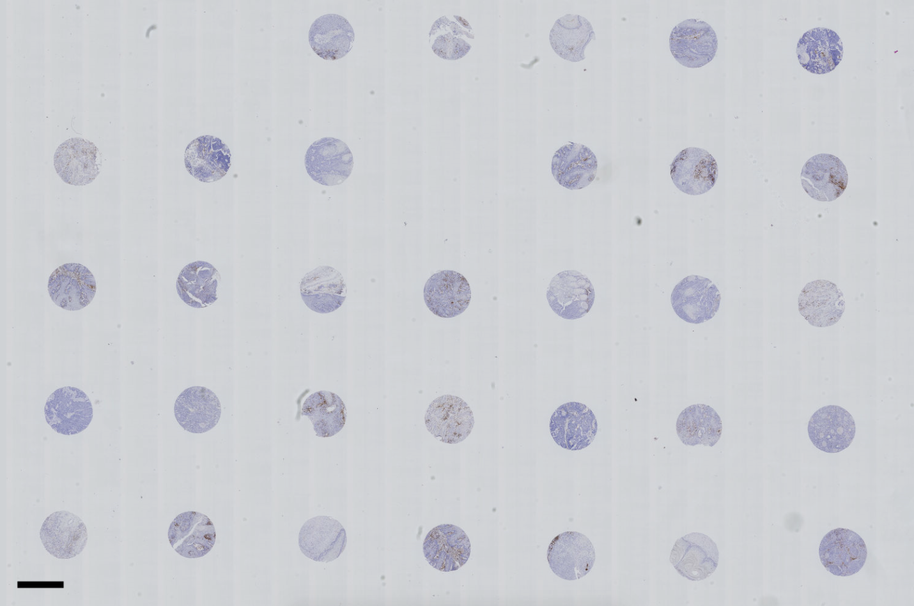

.. _Input_page:

***********
Input files
***********

Whole Slide Image files
=======================

  .. note::
     An example whole slide image file and excel document is hosted
     `here <https://emckclac-my.sharepoint.com/:f:/g/personal/k1472221_kcl_ac_uk/EutLIT4yc3BIlmNdUnDzLNAB0AcR1qc99Pvf8w-yCcmj_A?e=LXunb4>`_

Supported Formats
-----------------

NDPI (Hamamatsu) and SVS (Leica) files are accepted by the program as whole slide image files.

An example image of a WSI .ndpi file with tissue cores stained with DAB is given below:

Each core in this example is 1mm in diameter (the core diameter or number of cores is not a limitation for QuArray application). Scale bar is 1mm.

Tissue array map file
=====================

A spreadsheet (Excel *.xlsx) file acts as a map of the array.

The spreadsheet can also contain indexed information that is used for downstream analysis such as sample ID,
sample details (e.g. date of sample collection, type) and categories (e.g. normal or diseased).

File locations
==============

If the WSI file and the tissue array map file are saved in the same directory with the same name
then the array map will be loaded automatically when the WSI file is loaded. Otherwise, the user load the map file
separately.

Here is an example of a normal tree file structure containing the WSI file and the index file.

.. code-block:: bash

   .
   ├── WSI.ndpi
   └── WSI.xlsx

When the images are exported a new directory will be created inside the root to host output files.

User interface
==============

.. image:: images/Pathology_maps.png

Left - Image of the first tab.

Right - Image of the second tab.

The first tab contains 1 where a core is present and 0 where there is no core. There should be nothing in the rest
of the document.

The second tab contains pathology info and is used to make a figure if needed. This is not necessary to run the
program. The tab does not have to be named *Pathology* but should be in the second tab location. T and N stand for Tumour
and Normal respectively.